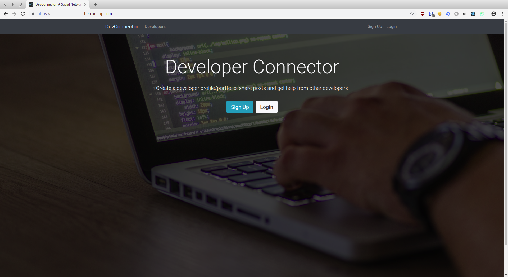
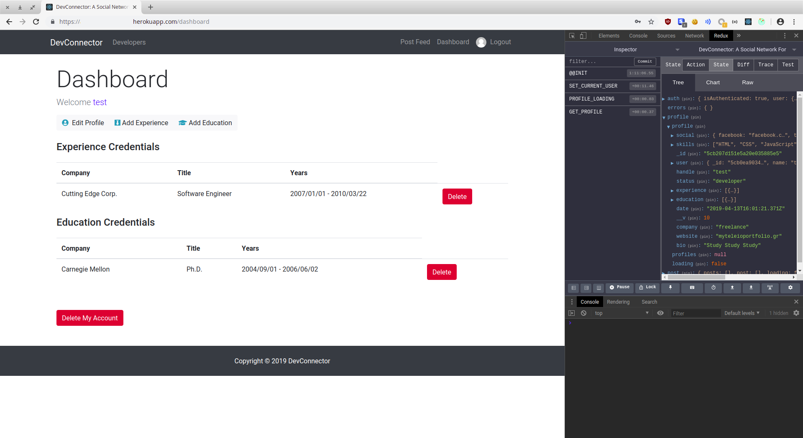
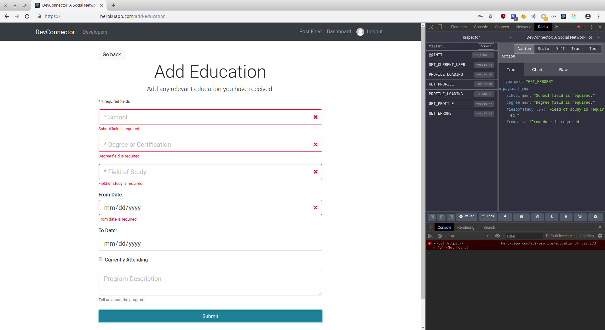
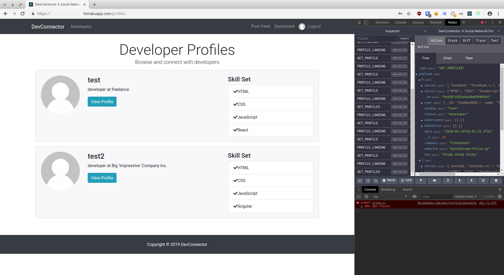
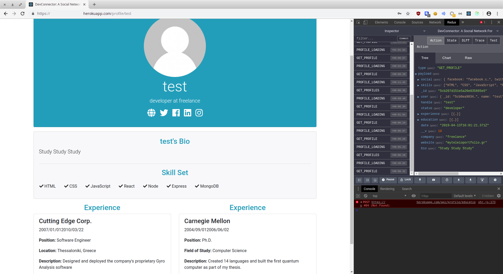
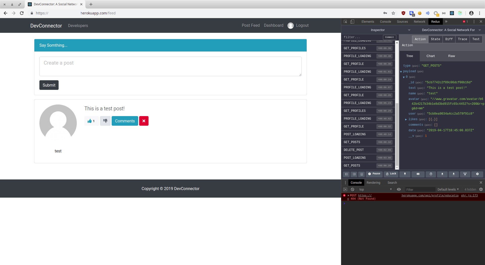
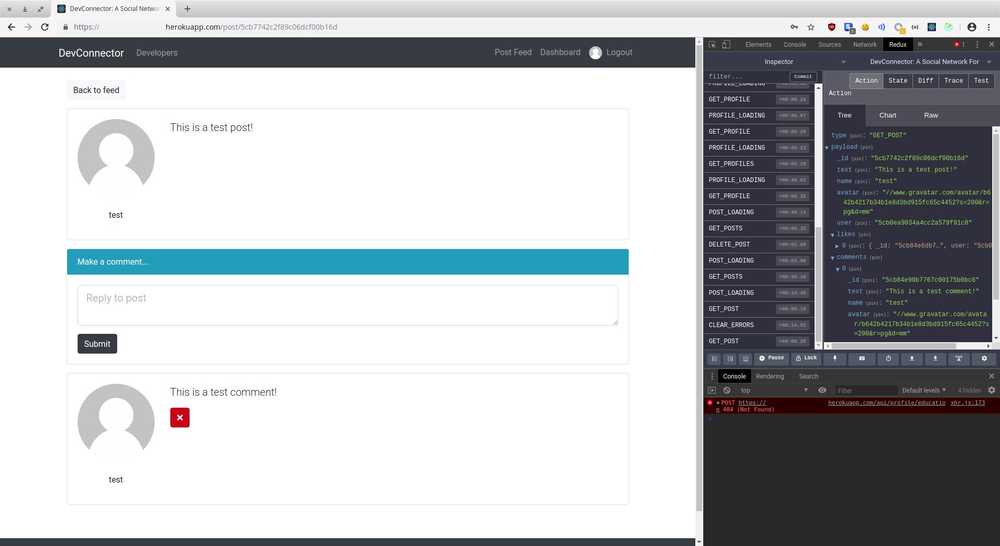

## Work from Udemy course "MERN Stack Front To Back: Full Stack React, Redux & Node.js"

#### This repository hosts all my work from the various coding challenges and projects completed while taking this udemy course: https://www.udemy.com/mern-stack-front-to-back/. 

#### Throughout the course you:

* Build a full stack social network app with React, Redux, Node, Express & MongoDB
* Build an extensive backend API with Node.js & Express
* Protect routes/endpoints with JWT (JSON Web Tokens)
* Perform extensive API testing with Postman
* Integrate React with our backend in an elegant way, creating a great workflow
* Build a React frontend to work with the API
* Use Redux for app state management
* Create reducers and actions for our resources
* Create many container components that integrate with Redux
* Test with the Redux Chrome extension
* Create a build script and deploy to Heroku using Git

#### It's a great course and I highly recommend it!

#### Below are some screenshots of the app you build throughout the course - a social network type for developers, with profiles, posts, comments, likes, and GitHub integration.

Basic landing page

User dashboard available after successful authN.

Clicking on the Add Education button from the dashboard leads to a form allowing the user to add education credentials, complete with error handling.

The general profiles page, which lists all registered profiles and a summary of their respective skill sets.

Clicking a View Profile button from above leads you to a single profile page, presenting the user with all profile details.

The app also offers a feed of all posts to be viewed in batch by the user, who can in turn like, dislike and comment on them (plus remove their own).

The user can then view all comments for a single post, with the ability to post a new one and / or delete their own.

